<p align="center">
  full-stack dev. mostly next.js and python, some c/c# when it needs to be fast or close to the system.<br/>
  i build internal tools, automation and ai agents for small businesses — and self-host whatever i can.
</p>

```python
class Tenjiixx:
    code   = ["typescript", "python", "c", "c#", "rust"]
    models = ["qwen", "llama", "mistral", "whisper"]    # local, quantized, gguf
    stack  = ["vllm", "llama.cpp", "qlora", "dspy", "mcp"]
    focus  = "agents that actually ship"
    motto  = "静水流深"
```


<h3 align="center">工具 <sub><sup>stack</sup></sub></h3>

<p align="center">
  
</p>

<h3 align="center">智能 <sub><sup>ai</sup></sub></h3>

<p align="center"><sub>inference</sub><br/>
  
  
  
  
  
  
  
</p>

<p align="center"><sub>fine-tuning</sub><br/>
  
  
  
  
  
  
  
</p>

<p align="center"><sub>agents · retrieval</sub><br/>
  
  
  
  
  
  
  
</p>

<p align="center"><sub>speech · vision</sub><br/>
  
  
  
  
</p>

<h3 align="center">作品 <sub><sup>work</sup></sub></h3>

<div align="center">

`document automation` · `invoicing pipelines` · `ops dashboards`<br/>
`local llm assistants` · `voice input` · `windows tooling in c / c#`

<sub>most of it lives in private repos.</sub>

</div>

<h3 align="center">记录 <sub><sup>activity</sup></sub></h3>

<p align="center">
  
</p>


